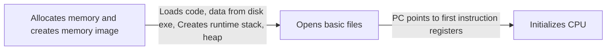

# OS_NOTES
OS were created for abstraction.

- The operating system manages process memory, including code, data, stack, and heap. Each process perceives it has a dedicated memory space starting from 0 (virtual addresses), while the OS abstracts actual memory placement and translates virtual addresses to physical ones.
- The OS includes code for managing external devices such as disk and network cards through device drivers. These drivers communicate with hardware devices, issuing instructions (e.g., fetching data from a file) and responding to interrupt events (e.g., user keypresses).

## Process Abstraction
process = a running program
OS timeshares CPU across multiple processes: virtualizes CPU. This gives the illusion that each process has its own dedicated CPU, even though the CPU is actually being rapidly switched between processes.
OS has a CPU scheduler that picks one of the many active processes to execute on a CPU– 
- Policy: which process to run 
- Mechanism: how to “context switch” between processes

### Components of a process
Process
├── Unique Identifier (PID)
├── Memory Image
│   ├── Code & Data (Static)
│   └── Stack and Heap (Dynamic)
├── CPU Context
│   ├── Registers
│   ├── Program Counter
│   ├── Current Operands
│   └── Stack Pointer
└── File Descriptors
    └── Pointers to Open Files and Devices

### how does a os create a process?

### states of a process
-  New: being created, yet to run
-  Dead: terminated
- Running: currently executing on CPU
- Ready: waiting to be scheduled
-  Blocked: suspended, not ready to run

**Process state transitions** refer to the changes in the state of a process as it progresses through its lifecycle in an operating system.

OS maintains a data structure of all active process, info about each process is stored in **Process control block**(PCB)

### Process API

API = appliation programming interface
    = functions available to write your own user programs
    
API's provided by OS are called system calls.  Sys calls have higher privilege level and can execute sensitive operations. user programs don't usually invoke a sys calls directly. The language libraries do that e.g printf in C lib

**POSIX** -  a standard set of systemcalls that an OS must implement. set as a standard by IEEE

Some sys calls in UNIX
**fork()** - creates new child process, A new process is created by making a copy of parent’s memory image initially.Just copy of each other during creation after fork, child and parent are independent. Every process is spawned as a child process.
> fork() function returns 0 in child and is non zero in parent and if for failed returns less than 0

 
**exit()** process termination or if OS terminates process. process exists as a zombie. when parent calls wait zombie is cleaned up and if parent is terminated before child. init process adopts orphans and reaps them (cleans).
init process is the ancestor of all process.

**exec()** - After fork, parent and child are running same code. A process can run exec() to load another executable to its memory image and it is no longer running the code of its parent. reboot as a new program.

> How a shell works? The init process spawns a shell like bash. Shell reads user command, forks a child, execs the command executable, waits for it to finish, and reads next command. you can redirect the output of a child process.(for eg redirecting output of a command on shell to a file).

### Mechanisms of process execution.
OS allocates memory and creates memory image. Points CPU program counter to current instruction. After setup, OS is out of the way and process executes directly on CPU. 

#### How is a system call different?
A **function call** translates to a jump instruction. Old value of PC,args etc is pushed to a new stackframe in stack.

- CPU hardware has multiple privilege levels – One to run user code: user mode – One to run OS code like system calls: kernel mode – Some instructions execute only in kernel mode
- Kernel does not trust user stack – Uses a separate kernel stack when in kernel mode
- Kernel does not trust user provided addresses tojump to Kernel sets up Interrupt Descriptor Table (IDT) at boot time – IDT has addresses of kernel functions to run for system calls and other events

#### Mechanism of system call
#### Trap instruction:
When system call must be made,a special trap instruction is run(hidden from user by libc). Trap can be considered as a software interrupt.
**Trap instruction execution:**
- 1. Move CPU to higher priviliege level.
- 2. switch to kernel stack.
- 3. look up address in IDT (Interrupt descriptive table) and jump to trap handles function in OS code.
System calls/interrupts store a number in a CPU register before calling trap, to identify which IDT entry to use.
> The interrupt descriptor table (IDT) is a data structure used by the x86 architecture to implement an interrupt vector table.
Trap is executed in following conditions.
- 	system call
-	program fault
- 	Interrupt
**Return from trap:**
When OS is done handling syscall or interrupt, it calls a special instruction **return-from-trap**.
- Restore context of CPU registers from kernel stack 
- Change CPU privilege from kernel mode to user mode
- Restore PC and jump to user code after trap

User process unaware that it was suspended,resumes execution as always
Before returning to user mode, OS checks if it must switch to another process. (eg. if exit system call was called, time share cpu with process, process has run for too long). In such cases, OS performs a **context switch** to switch from one process to another. OS scheduler (responsible for context switch.)
- Mechanism of context switch.
- Policy which process to run after context switch
Types
- Non preemptive scheduler(switch only if process is blocked.)
- Preemptive scheduler(can switch even if the process is ready to run.)

**Mechanism of a context switch**:
- Save context (PC, registers, kernel stackpointer) of process 1 on kernel stack
-  Switch SP to kernel stack of process2.Restore context from process2’s kernel stack. OS saved registers on process2’s kernel stack, when it switched out process2 in the past. Now, CPU is running process2 in kernel mode, return-from-trap to switch to user mode of process2,
context is saved on kernel when. 
- user to kernel mode, return-from-trap.
- context switch.

**Scheduling Policy**
OS scheduler schedules the CPU requests (bursts) of processes – CPU burst = the CPU time used by a process in a continuous stretch
**Scheduling policies**-
- FIFO (First in First out)
- SJB (Shortest Job First) non preemptive.
- STVF (Shortest time of completion first) preemptive.
- RR (Round-Robin) Every process executes for a fixed quantum slice

> Real time Scheduling policies are a little complex. Linux uses Multi Level Feedback Queue (MLFQ).
> - Many queues, in order of priority.
> - Process from highest priority queue scheduled first.
> - Within same priority, any algorithm like RR.
> - Priority of process decays with its age.
Linux also has command line utilities to set priority of processes.

#### Inter Process Communication (IPC)
Processes do not share any memory with each other. IPC mechanisms used to share information between processes.
- Shared Memory: Processes can both access same region of memory via shmget() system call. int shmget ( key_t key, int size, int shmflg ) providing same key, two processes can get same segment of memory

- Signals: A certain set of signals supported by OS. some have fixed meaning some can be defined. Signals can be sent by OS or by another process. Signal handler: every process has a default codeto execute for each signal. (e.g., if you type Ctrl+C, OS sends SIGINT signal to running process)

- Sockets: Can be used for 2 processes on same machine or diff machine to communicate.Processes open sockets and connect them to each other. Messages written into one socket can be read from another OS transfers data across socket buffers. E.g TCP/UDP sockets, unix sockets in local machine.

- Pipes: Pipes are half duplex can only send data. Pipe system call returns two file descriptors, Read handle and write handle.Regular pipes, both file descriptors read and write handle are in the same process. Parent and child share file descriptor after fork and communicate with pipe after fork. Named Pipes, two endpoints of a pipe can be indifferent processes 

- Message Queues: Mailbox abstraction. Process can open a mailbox at a specified location. Processes can send/receive messages from mailbox.

Some IPC actions can block, Reading from socket/pipe that has no data, or reading from empty message queue, writing to a full socket/pipe/message queue. The system calls to read/write have versions that block or can return with an error code incase of failure. A socket read can return error indicating no data to be read, instead of blocking.

## irtual Memory

Why virtual memory? real view of memory is messy..

**Virtual address space**: Every process assumes it has access to a large space of memory from address 0 to a MAX, contains code heap and stack. CPU issues loads and stores to virtual addresses.
**Memory management unit (MMU)** - Address translation from virtual addresses (VA) to physical addresses (PA), OS makes necessary information available.
Memory allocation system calls :-
**malloc** implemented by C lib, (malloc itself is not a sys call, the C lib calls the sys calls.)
**brk/sbrk** sys call is used to grow heap. It takes one argument (the address of the new break), and thus either increases or decreases the size of the heap based on whether the new break is larger or smaller than the current break.
**mmap()** can allocates an anonymous page size memory using this sys call.
**free** -  Display amount of free and used memory in the system
**pmap** - The pmap command reports the memory map of a process or processes, you have to know the process ID of the process you’re interested in.

E.g. :- **PAGING**
OS divides virtual address space into fixed size pages, physical memory into frames. To allocate memory, a page is mapped to a free physical frame. Page table stores mappings from virtual page number to physical
frame no. of a process. MMU has access to page tables, and uses it to translate virtual address to phyiscal address.

> Address space of OS, OS is not a separate process with its own address space Instead, OS code is part of the address space of every process (like a library in code). Page tables map the OS addresses to OS code. OS memory allocation, For large allocations, OS allocates a page. For smaller allocations, OS uses various memory allocation algorithms.

**Mechanism of address translation :-**
CPU provides privileged mode of execution, to set translation information.OS maintains free list of memory. Allocates space to process during creation (andwhen asked) and cleans up when done. Maintains information of where space is allocated to each process (in PCB). OS tells the hardware the base (starting address) and bound (total size of process) values. Memory Management Unit (MMU) calculates PA from VA. 
> phy add = vir add + base
MMU generates faults and traps to OS when access is illegal,like checking if address is beyond bound. OS is not involved in every translation.

### Segmentation
Generalized base and bounds. Each segment of memory image placed separately. Multiple (base, bound) values, stored in MMU. Good for sparse address spaces. But variable sized allocation leads to external fragmentation, small holes in memory left between segments.

### Paging
most common memory management techniques used in modern operating systems
Allocate memory in fixed size chunks “pages”.
Avoids external fragmentation (no small “holes”, holes:- small free memory blocks scattered throughout, unable to satisfy allocation requests despite sufficient total free memory.)
Has internal fragmentation (partially filled pages, even though need is small still wholepage is provided).

#### Page Table:

Per process data structure (OS updates page table upon context switch) to help VA-PA translation.Array stores mappings from
virtual page number (VPN) to physical frame number (PFN) .Part of OS memory (in PCB). MMU has access to page table and uses it for address translation.
Page table is an array of page table entries. The size of each page is 4 KB (2^12) and the virtual address is 32-bit wide, 
so 2^32 / 2^12 = 2^20 entries. If each Page table entry is 4 bytes (32-bit), then page table is 4MB. VPN (virtual page no.) is index into this array. Each PTE (page table entry) contains PFN (physical frame number) and few other bits. 
- Valid bit: is this page used by process? 
- Protection bits: read/write permissions 
- Present bit: is this page in memory? 
- Dirty bit: has this page been modified? 
- Accessed bit: has this page been recently accessed?

**what happens on memory access?**
- CPU requests code or data at a virtual address. 
- MMU must translate VA to PA
- Access memory to read page table entry – Translate VA to PA
Most significant bits of virtual address give the virtual page no.and the last few bits provide the offset into the page. Page table maps VPN to PFN, MMU stores (physical) address of start of page table, not all entries.
- Access memory to fetch the requested code/data.

Paging adds overhead to memory access...Solution for this is cache.

#### Translation Lookaside Buffer (TLB):
A cache of recent VA-PA mappings. To translate VA to PA, MMU first looks up TLB. If TLB hit, PA can be directly used, If TLB miss, then MMU performs additional memory accesses to “walk” page table (above mentioned procedure). TLB misses are expensive. TLB entries may become invalid on context switch and change of page tables.
 
#### Multilevel page tables:-
A page table is spread over many pages. An “outer” page table or page directory tracks the PFNs of the page table pages. Depending on how large the page table is, we may need more than 2 levels, 64-bit architectures may need 7 levels. 
**address translation:**First few bits of VA to identify outer page table entry. Next few bits to index into next level of PTEs.In case of TLB miss, multiple accesses to memory required to access all the levels of page tables.

#### Demand Paging:-
Demand paging is a memory management scheme where the operating system loads pages into main memory only when they are required by the executing process. This allows the system to efficiently utilize memory resources by storing only the actively used pages in main memory, while utilizing disk space (swap space) to temporarily store pages that are not currently needed.
**Page fault**
When translating VA to PA, MMU reads present bit. Present bit in page table entry: indicates if a page of a process resides in memory or not. 
If page not in memory, MMU raises a trap to the OS – page fault.
Page fault handling -
- OS and moves CPU to kernel mode.
- OS fetches disk address of page and issues read to disk.
- Reading from disk takes a long time,OS context switches to another process – Current process is blocked (waiting) and cannot run.
- When disk read completes, OS updates page table of process, and marks it as ready
- When process scheduled again, OS restarts the instruction that caused page fault.

When servicing page fault, what if OS finds that there is no free page to swap in the faulting page?
OS must swap out an existing page (if it has beenmodified, i.e., dirty) and then swap in the faulting page. OS may proactively swap out pages to keep list of free pages handy.
**Page replacement policies:**
- Optimal: replace page not needed for longest time in future (not practical!).
-  FIFO: replace page that was brought into memory earliest (may be a popular page!, usually worse than optimal, worse as memory size increases).
-  LRU/LFU: replace the page that was least recently (or frequently) used in the past.– how does it know which page is LRU? Hardware help and some approximations, MMU sets a bit in PTE (“accessed” bit) when a
page is accessed. OS periodically looks at this bit to estimate pages
that are active and inactive To replace, OS tries to find a page that does not have access bit set – May also look for page with dirty bit not set.

### Summary - Memory Access 
- CPU issues load to a VA for code or data – Checks CPU cache first.
- Goes to main memory in case of cache miss. 
- MMU looks up TLB for VA
- If TLB hit, obtains PA, fetches memory location and returns
to CPU (via CPU caches) 
- If TLB miss, MMU accesses memory, walks page table, and obtains page table entry
- If present bit set in PTE, accesses memory
- If not present but valid, raises page fault. OS handles page fault and restarts the CPU load instruction
- If invalid page access, trap to OS for illegal access

### Memory allocation algorithms

#### Variable sized allocation

**Headers:-** 
Consider an implementaion of malloc(), Every allocated memory chunk has a header with info like size of chunk. We need to know the size to know how much to free when free() is called.

**Free list:-** 
In memory management, free space is organized as a linked list of memory blocks, where each block contains a pointer to the next free block. The memory management library tracks the head of this list, and allocations occur from the head. When memory is deallocated, the library updates the list, potentially merging adjacent free blocks to optimize memory usage.

**External fragmentation:-**
In memory management, when allocations and deallocations occur, free space becomes fragmented, meaning it is divided into non-contiguous blocks. This fragmentation can lead to inefficient memory usage, as even though the total amount of free space might be sufficient, the scattered nature of the blocks may prevent satisfying large allocation requests. This occurs because the free space is not contiguous, making it impossible to allocate a single large block despite the presence of enough free memory overall.

**Splitting and Coalescing:-**
When the free list  has a bunch of free chunks that are adjacent. A smart algorithm would merge them all into a bigger free chunk. Must split and coalesce free chunks to satisfy, variable sized requests.
**Buddy allocation for easy coalescing** Allocate memory in size of power of 2, Why? 2 adjacent power-of-2 chunks can be merged to form a bigger power- of-2 chunk, ease of implementation, fast allocation and dealloction.

**Variable Size Allocation Strategies:-**
- First fit: allocate first free chunk that is sufficient
- Best fit: allocate free chunk that is closest in size
- Worst fit: allocate free chunk that is farthest in size

#### Fixed size allocations
- Memory allocation is much simpler.
- Page-sized fixed allocations in kernel: – Has free list of pages – Pointer to next page stored in the free page itself
- For some smaller allocations (e.g., PCB - Process Control Block), kernel uses a slab allocator. Object caches for each type (size) of objects. Within each cache, only fixed size allocation. Each cache is made up of one or more “slabs”
> A slab is a contiguous block of memory divided into fixed-size chunks, each representing a cache line.
- Fixed size memory allocators can be used in user programs also (instead of generic malloc), more optimized.

## Concurrency

###Threads
**Threads**:- A thread is like another copy of a process that executes
independently.Threads shares the same address space (code, heap),each thread has separate PC, each thread may run over different part of the program. Each thread has separate stack for independent function calls.
Why threads? Parallelism and Concurrency. 

**Concurrency** refers to the ability of a system to handle multiple tasks or processes simultaneously. These tasks may start, run, and complete independently of each other, and they may overlap in time.Concurrency is running multiple threads/processes at the same time, even on single CPU core, by interleaving their executions.

**Parallelism**, on the other hand, refers to the simultaneous execution of multiple tasks or processes, where each task runs independently of the others and truly executes simultaneously. Parallelism is running multiple threads/processes in parallel over different CPU cores.

#### Thread Scheduling
- OS schedules threads much like processes. The context of a thread (PC, registers) is saved into/restored from thread control block (TCB). Every PCB has one or more linked TCBs.

- Threads that are scheduled independently by kernel are called kernel threads. 

> Some libraries provide user-level threads, User program sees multiple threads. Library multiplexes larger number of user threads over a
smaller number of kernel threads. Low overhead of switching between user threads (no expensive context switch). But multiple user threads cannot run in parallel.

**Race conditions**
When multiple threads execute on the same piece of data on the same time,concurrent execution can lead to different results. This is called Race conditions.
Critical section: portion of code that can lead to race conditions
To avoid race conditions, race conditions should be executed with, mutual exclusion (Only one thread should be executing critical section at any time) and atomicity (The critical section should execute like one uninterruptible instruction). This is achieved with Locks.

#### Locking

Locking is a mechanism used in concurrent programming to coordinate access to shared resources, ensuring that only one thread at a time can access the resource,to prevent data corruption or inconsistency.

**Lock variable:-** A lock variable, also known as a mutex (short for mutual exclusion), is a synchronization primitive used in concurrent programming to prevent multiple threads from accessing a shared resource simultaneously.
All threads accessing a critical section share a lock. One threads succeeds in locking – owner of lock. Other threads that try to lock cannot proceed further until lock is released by the owner.
Goals of lock implementation:
- Mutual exclusion
- Fairness: all threads should eventually get the lock, and no thread should starve.
- Low overhead: acquiring, releasing, and waiting for lock should not consume too many resources

**Deadlock** :- A deadlock is a situation in concurrent programming where two or more threads are unable to proceed because each is waiting for a resource that another thread holds, resulting in a circular wait.

##### Fail Conditiions
**Can your lock function simply be disable interrupts?**
- Disabling interrupts is a privileged instruction and program can misuse it (e.g., run forever).
- Will not work on multiprocessor systems, since another thread on another core can enter critical section.
**Can your lock function by using flags?**
Consider,
- Both thread_1 and thread_2 start simultaneously.
- Both threads execute their respective functions (thread_1_func and thread_2_func), where they set the flag variable to True.
- Due to the lack of synchronization, there is no guarantee about the order in which the threads will execute or when the updates to the flag variable will occur.
- As a result, there is a race condition: whichever thread updates the flag variable last will determine its final value.

**SOLUTION :-** Hardware atomic instructions.
Atomicity means that an operation either happens completely or not at all, without being interrupted by other operations.
Very hard to ensure atomicity only in software, modern architectures provide hardware atomic instructions
Eg.**test-and-set** – Update a variable and return old value, all in one hardware instruction. This is called a spin lock (all the other threads keep spinning till they acquire the lock.)
**compare-and-swap**,This is also a spin lock.
Spin locks waste CPU resources as one thread has the lock the others keep on spinning continuously.
Alternative to spinning -> **Sleeping mutex**
When a thread tries to acquire the mutex/lock and finds it unavailable, it goes to sleep until the mutex becomes available, preventing unnecessary CPU usage. When the mutex is released, one of the sleeping threads is woken up to acquire it.
 
>Most userspace lock implementations are of the sleeping mutex kind. Locks inside the OS are always spinlocks, why? who will the OS yield to for lock/mutex status?

##### How locks should be used?
- When OS acquires a spinlock, It must disable interrupts (on that processor core) while the lock is held. Why? An interrupt handler could request the same lock, and spin for it forever. 
- It must also not perform any blocking operation – never go to sleep with a locked spinlock!
- A lock should be acquired before accessing any variable or data structure that is shared between multiple threads of a process, such implementations of datastructures are called “Thread-safe” data structures.
- All shared kernel data structures must also be accessed only after locking
- Coarse-grained locking: A synchronization approach where a single lock is used to protect access to a large portion of shared data or critical section.
- Fine-grained locking: A synchronization approach where multiple locks are used to protect smaller, more granular portions of shared data or critical section, allowing for greater concurrency.

#### Condition variables
Locks provide one type of synchronization between threads - mutual exclusion. Another common requirement is waiting and signaling, e.g.Thread T1 wants to continue only after T2 has finished some task,this could be established by waiting on some variable but it is inefficient.

A **condition variable** (CV) is a queue that a thread can put itself into when waiting on some condition. Another thread that makes the condition true can signal the CV to wake up a waiting thread. Signal wakes up one thread, signal broadcast wakes up all waiting threads.

#### Semaphores
Is is also a synchronization primitive like condition variables,**Semaphore** is a variable with an underlying counter.
Two functions on a semaphore variable:-
- Up/post increments the counter and wakes up one of the sleeping processes (if it exists), irrespective of the value of the semaphore counter.
- Down/wait decrements the counter and blocks the calling thread if the resulting value is negative.

> A semaphore with init value 1 acts as a simple lock (binary semaphore = mutex)

### Bugs in concurrent program
Two types of bugs 

**Deadlock** bugs: threads cannot execute any further and wait for each other.
Conditions for deadlock:
- **Mutual exclusion**: a thread claims exclusive control of a resource (e.g., lock) 

- **Hold-and-wait**: thread holds a resource and is waiting for another
Fix:
Acquire all locks at once, say, by acquiring a master lock first. But this method may reduce concurrent execution and performance gains.

- **No preemption**: thread cannot be made to give up its resource (e.g.,cannot take back a lock)

- **Circular wait**: there exists a cycle in the resource dependency graph.
Fix: Acquire locks in a certain fixed order.Total ordering (or even a partial ordering onrelated locks) must be followed

**Non-deadlock** bugs: non deadlock but incorrect results when threads execute.
Types:-
- **Atomicity bugs** :– atomicity assumptions madeby programmer are violated during executiono f concurrent threads 
Fix: 
Locks for mutual exclusion.

- **Order-violation bugs** – desired order of memory accesses is flipped during concurrent execution. 
Fix: 
Condition variables

## I/O and Filesystems

### Communication with I/O devices
I/O devices connect to the CPU and memory via a bus.e.g PCI, SCI, USB, SATA. Point of connection to the system is called **port**.
I/O devices are of 2 types.
- Block devices store a set of numbered blocks (disks)
- Character devices produce/consume stream of bytes.
(keyboard,network card)

The internals of device are usually hidden. Devices expose an interface of memory registers:-
- Current status of device 
- Command to execute 
- Data to transfer

The OS read/write to registers by :-
- Explicit I/O instructions :- E.g., on x86, in and out instructions can be used to read and write to specific registers on a device. Privileged instructions accessed by OS.
- Memory mapped I/O :- Device makes registers appear like memory locations – OS simply reads and writes from memory – Memory hardware routes accesses to these special memory addresses to devices.

**Polling** is a technique used in computing where a program or device continuously checks the status of a condition or resource at regular intervals.

Simple execution if I/O requests:
- Polling status to see if device ready – wastes CPU cycles.
- Programmed I/O – CPU explicitly copies data to/from device. It involves the CPU actively transferring data to and from the peripheral manually reading or writing data to control registers.

#### Interrupt driven I/O
Polling wastes CPU cycles,instead, OS can put process to sleep and
switch to another process.When I/O request completes, device raises
interrupt

##### Interrupt handler:-
- Interrupt switches process to kernel mode.
- **Interrupt Descriptor Table (IDT)** stores pointers to interrupt handlers (interrupt service routines).
- Interrupt **(IRQ)** number identifies the interrupt handler to run for a device.
- Interrupt handler acts upon device notification,unblocks the process waiting for I/O (if any), and starts next I/O request (if any pending).
- Handling interrupts imposes kernel mode transition overheads.

>  polling may be faster than interrupts if device is fast.

#### Direct Memory acess (DMA):-
CPU cycles wasted in copying data to/from device.Instead, a special piece of hardware (DMA engine) copies from main memory to device. A DMA engine is hardware that transfers data between peripherals and memory directly, bypassing the CPU. This speeds up data transfer, reduces CPU overhead, and allows for parallel processing.CPU gives DMA engine the memory location of data. 
- In case of read, interrupt raised after DMA completes. 
- In case of write, disk starts writing after DMA completes.

**Device driver:** part of OS code that talks to specific device, gives commands, handles interrupts etc. Most OS code abstracts the device details. 

### Files and Directories
**File** – linear array of bytes, stored persistently. Identified with file name (human readable) and a OS-level identifier **“inode number”**. Inode number unique within a file system.

**Directory** - Directory contains other subdirectories and files, along with their inode numbers.Stored like a file, whose contents are **filename-to-inode** mappings.
Files and directories arranged in a **tree**(in unix like system), starting with root (“/”).

#### Operation on files

- open() :- sys call creates/opens a file and returns a file descriptor.
**file descriptor** is a number through which you can access a file.
Existing files must be opened before they can be read/written.Also uses open system call, and returns file descriptor.
- close() :- sys call closes the file.
- read()/write() :- sys call, reading/writiing files. args : file descriptor, buffer with data, size.Reading and writing happens sequentially by default.Successive read/write calls fetch from current offset.
- lseek() :- sys call lets you seek to random offset, if you want to read/write at random location.
- fsync() :- Writes are buffered in memory temporarily, fsync() system call flushes all writes to disk.
- rename()
- delete() :- unlink file
- stat() :- get statistics of a file

#### Operations on directories
Directories can also be accessed like files with operations like create, open, read, close.
For e.g, the “ls” program opens and reads all directory entries. Directory entry contains file name, inode number, type of file (file directory) etc.

#### Hardlinks
Hard linking creates another file that points to the same inode number (and hence, same underlying data). If one file deleted, file data can
be accessed through the other links. Inode maintains a link count, file data deleted only when no further links to it. You can only unlink, OS decides when to delete.

#### Soft links or symbolic links
Soft link is a file that simply stores a pointer to another filename an alias, you can acess the file by the other names. If the main file is deleted, then the link points to an invalid entry: dangling reference.

#### Mounting a file system.
Mounting a filesystem connects the files to a specific point in the directory tree. Several devices and file systems are mounted on a typical machine, accessed with **mount** command.

#### Memory mapping a file
Alternate way of accessing a file, instead of usingfile descriptors and read/write syscalls.
**mmap()** sys call allocates a page in the virtual address
space of a process, to which you can read/ write.
Two ways to invoke mmap():
- “Anonymous” page: used to store program data 
- File-backed page: contains data of file (filename provided as arg to mmap)
When file is mmaped, file data copied into one or more pages in memory, can be accessed like anyother memory location in program.

### FileSystem and implementation

#### Filesystem
An organization of files and directories on disk. OS has one or more file systems.
2 main aspects of file system
- Data structures to organize file data and metadata (information about the data) on disk.
- Implementation of system calls like open, read, write using the data structures.
Disks expose a set of blocks (usually 512 bytes). File system organizes files onto blocks. System calls translated into reads and writes on blocks.

##### A simple file system
- **Data blocks**: file data stored in one or more blocks
- **Metadata** : Location of data blocks of a file, permissions etc about every file stored in inode.
- **Inode blocks**: each block has one or more inodes
- **Bitmaps**: indicate which inodes/data blocks are free
- **Superblock**: holds master plan of all other blocks (which are inodes, which are data blocks etc.)

**Inode Table**is a data structure used by Unix-like operating systems to manage files and directories on a filesystem. It stores metadata information about each file or directory.
The inode stores:
- File metadata: permissions, access time, etc. 
- Pointers (disk block numbers) of file data

**Inode structure**
File data is not stored contiguously on disk, need to track multiple block numbers of a file.The inode tracks block number with:-
- **Direct pointers:** numbers of first few blocks are stored in inode itself (suffices for small files) 
- **Indirect block:** for larger files, inode stores number
of indirect block, which has block numbers of filedata 

Similarly, **double and triple indirect blocks** (multilevel index)

**File Allocation Table (FAT)**
Alternate way to track file blocks. FAT stores next block pointer for each block 
- FAT has one entry per disk block.
- Entry has number of next file block, or null (if last block).
- Pointer to first block stored in inode.

**Directory structure**
Directory is a special type of file and has inode and data blocks (which store the file records).
Directory stores records mapping filename to inode number, Linked list of records, or more complex structures (hash tables, binary search trees, etc.) 

##### Free space management
Bitmaps, for inodes and data blocks, store one bit per block to indicate if free or not 
Free list, super block stores pointer to first free block, a free block stores address of next block onlist 
More complex structures can also be used

##### Opening a file
To open is ? To have the inode readily available (inmemory) for future operations on file. Open returns fd which points to in-memory inode. Reads and writes can access file data from inode.
What hppens during open?
- The pathname of the file is traversed, starting at root – Inode of root is known, to bootstrap (initializing a program or system, often including setting up necessary configurations and dependencies to enable its execution) the traversal.
- Recursively do: fetch inode of parent directory, read
its data blocks, get inode number of child, fetch inode of child. Repeat until end of path 
- If new file, new inode and data blocks will have to be allocated using bitmap, and directory entry updated.

**Open file table**
Table to track all the open files
- **Global open file table**
One entry for every file opened (even sockets, pipes). Entry points to in-memory copy of inode (other data structures for sockets and pipes)
- **Per-process open file table**
Array of files opened by a process.File descriptor number is index into this array. Per-process table entry points to global open file table entry. Every process has three files (standard in/out/err)
open by default (fd 0, 1, 2)

> Open system call creates entries in both tables and returns fd number

##### Reading/ and writing a file
- Access in-memory inode via file descriptor 
- Find location of data block at current read/write offset 
- Fetch block from disk and perform operation 
- Writes may need to allocate new blocks from disk using bitmap of free blocks 
- Update time of access and other metadata in inode

##### Virtual File system
File systems differ in implementations of data structures (e.g., organization of file records in directory).Linux supports virtual file system (VFS) abstraction. VFS looks at a file system as objects (files, directories,inodes, superblock) and operations on these objects (e.g., lookup filename in directory).System call logic is written on VFS objects.
To develop a new file system, simply implement functions on VFS objects and provide pointers to these functions to kernel. Syscall implementation does not have to change with file system implementation details.

##### Disk buffer cache
Results of recently fetched disk blocks are cached. If cache is full LRU is used to evict the cache.

File system issues block read/write requests to block numbers via buffer cache.If block in cache, served from cache, no disk I/O. If cache miss, block fetched to cache and returned to file system.

Writes are applied to cache block first 
- Synchronous/write-through cache writes to disk immediately 
- Asynchronous/write-back cache stores dirty block in memory and writes back after a delay.

Unified page cache in OS. Buffer cache is dynamically allocated.Free pages allocated to both processes and disk buffer cache from common pool.

Benefits 
- Improved performance due to reduced disk I/O(one disk access for multiple reads and writes) 
- Single copy of block in memory (no inconsistency across processes)

> Some applications like databases may avoid caching altogether, to avoid inconsistencies due to crashes: direct I/O

#### Hard disk internals
Internals : A set of 512-byte blocks (sectors), that can be read or written atomically.One or more platters, connected bya spindle, spinning at ~10K RPM (rotations per minute).Each platter has a disk head and arm. A platter is divided into multiple tracks, and each track into 512-byte sectors.

##### Time taken for disk I/O operation

Time taken to read/write a block consists of 
- **Seek time**, time taken  to get to the right track (few ms) 
- **Rotational latency**, time taken for disk to spin to correct sector onthe track (few ms) 
- **Transfer time**, time taken to read sector (few tens microsec)

> Given high seek and rotational latency, usually rate of **sequential access** > rate of **random access**. 

##### Optimization algorithms
**Disk Scheduling**
Requests to disk are not served in FIFO, they are reordered with other pending requests.In order to read blocks in sequence as far as possible, to minimize seek time and rotational delay. OS does not know internal geometry of disk, so scheduling donemostly by disk controller.

**Shortest Seek Time First (SSTF)**
Access block that we can seek to fastest. Problem: starvation, some requests that are far from current position of head may never get served.

**Elevator/SCAN algorithm**
Disk head does one sweep over tracks and serves requests that fall on the path.Sweep outer to inner, then inner to outer.
- C-SCAN: sweep only one direction (say, outer to inner) and circle back, start again because, sweeping back and forth favors middle tracks more.
- F-SCAN: freeze queue while scanning. To avoid starving far away requests.

**Shortest Positioning Time First (SPTF)**
Considers both seek time and rotational latency

##### Data storage on disk
Bits stored on disk with some error detection/correction bits.
- Correct random bit flips 
- Detect corruption of data
Disk controller or OS can handle some errors (e.g., blacklisting certain sectors) If errors cannot be masked, user perceives harddisk failures,technologies such as RAID (Redundant Array of Inexpensive Disks) provide high reliability and performance by replicating across multiple disks.

