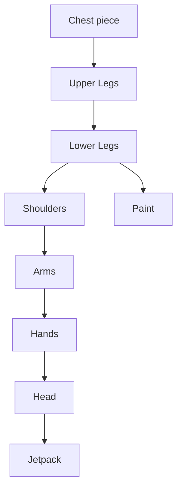

# RX-78

Hello there, hope you are doing well, and I finally decided to write a blog for the first time after 8 months. what can I say as an excuse, I was just too lazy I think. Anyway, today I am writing about my experience while building the [**Gundam Rx-782**](https://en.wikipedia.org/wiki/Gundam) model. I love giant mech suits be it the Iron man Mark XLIV Hulkbuster armour or Power Loader from the ALIENS, mech suits are the most badass things to ever exist and I dream of making one in the future. I started building the model on, the 15th of July and completed it on the 14th of august. The build was completed within a month, which is x2 the time I aimed for :sweat_smile:.

*P.S - I'm not a professional blog writer nor an expert maker so bear with me, also all my recorded image data was lost so the images posted here are from my instagram handle and are not the best.*

 So a few months ago, this is before starting the RX-782 build I was just tinkering with mini servo motors and Arduino trying to build a pair of legs capable of walking, and I failed again (not a new thing for me). The thing is I don't own a 3D printer nor do I know how to use one. I use simple cardboard and hot glue to build any casing or body part that I need. It so happened that the servo motors found it easier to move in its casing, ripping the hot glue rather than lifting a 5.9-inch cardboard leg. Well, of course, it was my lack of design skills to blame.

 

To make the legs able to walk was my secondary objective, my primary objective was to make them scrap metal aesthetic, spikey dieselpunk-fueled legs. This is another thing I love, "aesthetics". Take a few seconds and embrace this beast of a steampunk art on your screen. I always wanted to build some cool dioramas and models, but since the motors didn't do what they were supposed to I scrapped my idea and threw my attempt in a drawer, delaying to did it sometime later. So while successfully wasting my time on Instagram I came across some intricate Gundam models and dude! they are to far complicated check this link to know. And so on the evening of the 14th of July, returning home after incurring another failure at building a rocket motor for my model rocket project "The Hell Raiser" (more on that on another day), I anxiously decided to build a model of the great Rx-782. The Granddaddy of all mech suits.

  

I began by looking for images, blueprints or 3D models on the internet or any other source that would give me with dimensions of the model. I found this image with some rough dimensions and then with the help of this image, I calculated all the dimensions by simple mathematics (from the 5th grade I suppose).

  

Let me explain to you with an example, consider the following image. Suppose you want to build a square. The length of the side of the outer square is 10 cm is given and you want to know what will be the length of the side of the inner square. It is simple to take a ruler place it on the screen and note the ratio of the outer side to the inner side.

Xi = Outerside build Yi = Innerside build

Xj = Outerside screen measure Yj = Innerside screen measure

Here you know Xi = 10 cm, you measured Xj and Yj with a ruler. Now find Yi. Its very simple

  

Xi / Yi = Xj / Yj

Yi = Xi * Yj / Xj

now put in the values and get the answer.

  

After calculating all the dimensions I sketched a rough drawing of the model I had in my mind. And then I began by cutting the pieces with the help of almighty hot glue, I assembled the pieces one by one in the following order,

Going with the Chest piece at first, narrowed my vision of how the model was going to look and also perked me up. The legs were to be built stronger than the rest of the model. It had to bear all the weight as well as maintain the centre of gravity, so I made them double-layered this is with 2 layers of cardboard and also placed a few dry batteries for weight. I tried to keep some mobility in the model with the arms. The shoulders and elbows are moveable joints so Rx-78-2 could try some poses with its most beautiful plasma sword and shield. Regarding the sword and the shield, initially, I was going to make a gun and a shield, similar to the S.W.A.T ones, but I found the gun design to be a little complex and it would add more to the load, and a plasma sword is way much cooler. The hardest part to make was the hands and the head (damn that head). I know I messed it up with the head it's a little big. It took me 4 hours to make something close to a head and considering my efforts I was self-satisfied with the results. The same story goes with the hands and fingers, but the thing it's a little low profile than the head and goes unnoticed.

I began with painting the model after completing the shoulders nearly 60% of the model. I couldn't trust myself for doing the paint, and I'm 100% sure that I would've messed it up in every way possible. Therefore, for the paint job I asked for some help from a friend. His name is [Shantanu Shinde](https://www.instagram.com/gladiator_13_02/) and he is a brilliant artist (Check out his Instagram page through the hyperlink to view more of his creations). We decided to paint the model with acrylic paint since it gave that glossy look that I needed for my RX-78-2. Before starting with the paint surface details and textures were added wherever needed. We painted with 2 layers to smooth out the rough texture of the cardboard. 

After finishing with the paint, it was time for the grand assembly. That was easy just hot-glueing stuff. I used pencil pieces to act as a pivot, for the movable joints of the shoulders and the elbow,  After assembly, I made a platform for the model, by glueing some anti-static foam on the top of a flat cardboard box.
Finally, after completing the assembly, I gave it some final details, then gently placed the model on the platform adding a name tag for the last final touch.

 And Baaam! I completed the build on the night of the 14th of August. It roughly took me 29 days, 7 hours and 33 minutes, and yes a lot of sweat and grind to finish the RX-78-2 model.

In the end, I would say it was all worth it. Initially, I was very nervous about the build, and  I believed that I was going to end up in another failure, another half-done project. I know the final result is not perfect and ideal as it needs to be, with its head a little larger in proportion than the rest of the body, it slightly looks more like a funko pop. But thanks to this project I was able to dip my toes in the vast waters of model-making and dioramas, and I will give it a try again in the future with a different model or perhaps a diorama. Well, see you in the next blog, I'll try my best to post regularly. Until then, keep exploring and do what you love, peace out.
