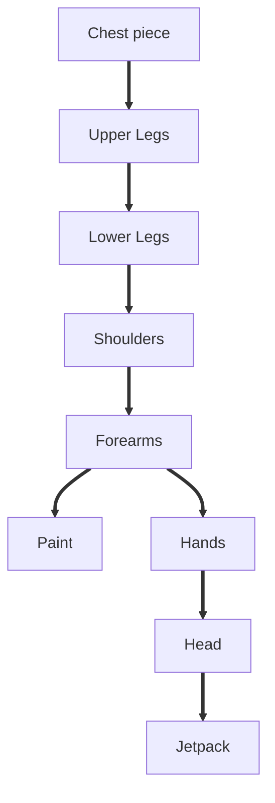

# RX-78

Hello there, so I finally decided to write a blog for the first time after 8 months. what can I say as an excuse, I was just busy being lazy. I love giant mech suits be it the Iron man Mark XLIV Hulkbuster armour or Power Loader from the ALIENS, mech suits are the most badass weaponry in science fiction and today I am writing about my experience while building the [**Gundam Rx-782**](https://en.wikipedia.org/wiki/Gundam) model. I started building the model on, the 15th of July and completed it on the 14th of august. The build was completed within a month which is x2 the estimated time. 

*P.S - I'm not a professional blog writer nor an expert maker so bear with me, also all my recorded image data was lost, so the images posted here are from my instagram handle and are not of the best quality.*

 So a few months ago, this is before starting the RX-782 build I was just tinkering with mini servo motors and Arduino trying to build a pair of legs capable of walking, and I failed (not a new thing for me). I used simple cardboard and hot glue for making the legs. It so happened that the servo motors found it easier to move in their casing, ripping the hot glue rather than lifting a 5.9-inch cardboard leg. Well, of course, it was my lack of design skills to blame.
 
 

To make the legs able to walk was my secondary objective, my primary objective was to make them scrap metal aesthetic, spikey dieselpunk-fueled legs. This is another thing I love, "aesthetics". I always wanted to build some cool dioramas and models, but since the motors didn't do what they were supposed to I scrapped my idea and threw my attempt in a drawer, delaying to did it sometime later. One day while successfully wasting my time on Instagram I came across some intricate Gundam models and dude! they are so cool. These model kits are expensive starting from around 20 $, which is around around 1,600 Indian rupees by todays standards, but why waste so much money when you can build it under a 100 bucks with hot glue and cardboard. And so on the evening of the 14th of July, returning home after incurring another failure at building a rocket motor for my model rocket project "The Hell Raiser" (more on that on another day), I anxiously decided to build a model of the great Rx-782. The Granddaddy of all mech suits.

The RX-78-2 Gundam is one of the orignal mobile gundam suits (basically large robot type, manned war-machines). It was introduced in 1979 in Yoshiyuki Tomino's and Sunrise's anime series [Mobile Suit Gundam](https://gundam.fandom.com/wiki/Mobile_Suit_Gundam). Gundam sparked the idea of giant-super robots to another level, the concept was adapted by many science fiction works, giant mechs became a must in science-fiction. But soon after the series ended it began falling into obscurity and had to be saved. Suprisingly it was saved by toys, [Gundam model kits](https://en.wikipedia.org/wiki/Gundam_model) also known as Gunpla.

 

Gundam model building as a hobby is now a worldwide phenomenon. Like any hobby, gunpla building can be extremely involved and expensive, but with model kits starting at less than US$20 and requiring no special tools or materials, barrier to entry is low. Some hobbyists build dioramas around finished models using techniques shared with other miniature model-based hobbies such as model railroading and wargaming. A diorama could depict a mecha in combat, undergoing maintenance or even destroyed on the battlefield. Bandai holds an annual international contest, Gunpla Builders World Cup,,in at least 16 countries. Winners are awarded trophies and model kits.

For my model, I began by looking for images, blueprints or 3D models on the internet or any other source that would give me with dimensions of the model. I found this image with some rough dimensions and then with the help of this image. I calculated all the dimensions by simple mathematics.

 

Let me explain to you with an example, consider the following image. Suppose you want to build a square. The length of the side of the outer square is 10 cm is given and you want to know what will be the length of the side of the inner square. It is simple to take a ruler place it on the screen and note the ratio of the outer side to the inner side.

 

Xi = Outerside build  ;          Yi = Innerside build

Xj = Outerside screen measure  ;  Yj = Innerside screen measure

Here you know Xi = 10 cm, you measured Xj and Yj with a ruler. Now find Yi. Its very simple
  
Xi / Yi = Xj / Yj

Yi = Xi * Yj / Xj

now put in the values and get the answer.

After calculating all the dimensions I sketched a rough drawing of the model. By taking reference to that drawing I drew a layout of the pieces to be cut on a cardboard sheet. I cut the pieces from the layout using a box cutter and assembled the pieces one by one with the help of the almighty hot glue and developed whole parts. This process was repeated for every part.

I made the pieces in the following order:

Going with the Chest piece at first, narrowed my vision of how the model was going to look. The legs were to be built stronger than the rest of the model beacuse It beared all the weight. So I made them double-layered with 2 layers of cardboard. To maintain the centre of gravity I placed a few dry batteries at the bottom. I tried to keep some mobility in the model. The shoulders and elbows are moveable joints so Rx-78-2 can try some poses with its most fierce plasma sword and shield. Initially, I was going to make a gun and a shield, similar to the ones used by the S.W.A.T, but making the gun was far more complex, it would've added more to the load, anyway plasma sword is way much cooler. The hardest part to make was the hands and the head (damn that head). I know I messed it up with the head it's a little big. It took me 4 hours to make something close to a head and considering my efforts I was self-satisfied with the results. The same story goes with the hands and fingers, but the thing it's a little low profile than the head and goes unnoticed.

I began with painting the model after completing the forearms. I couldn't trust myself for doing the paint myself, and I'm 100% sure that I would've messed it up in every way possible. Therefore, for the paint job I asked for some help from a friend. His name is [Shantanu Shinde](https://www.instagram.com/gladiator_13_02/) and he is a brilliant artist (Check out his Instagram page through the hyperlink to view more of his creations). Before starting with the paint surface details and textures were added wherever needed. We decided to paint the model with acrylic paint since it gave that glossy look that I needed for my RX-78-2. We used [Fevicryl acrylic colours](https://www.amazon.in/Fevicryl-Acrylic-colors-Sunflower-Shades/dp/B00LXTFMRS/ref=sr_1_6?adgrpid=60017284478&ext_vrnc=hi&gclid=Cj0KCQiAyMKbBhD1ARIsANs7rEESoksapafjw9XqlGHpTJ49tQjezQM6KgoEhogUxo8-PIqASLxXQbQaAlJoEALw_wcB&hvadid=379957635054&hvdev=c&hvlocphy=9301591&hvnetw=g&hvqmt=b&hvrand=11604356328590173936&hvtargid=kwd-969199519341&hydadcr=23646_1936986&keywords=acrylic+color+fabric&qid=1668347739&qu=eyJxc2MiOiIxLjAwIiwicXNhIjoiMC4wMCIsInFzcCI6IjAuMDAifQ%3D%3D&sr=8-6)and these were the colours that we used
* White
* Golden Yellow
* Crimson
* Cerulean Blue
* Black

After finishing with the paint, it was time for the grand assembly. This was easy, just hot-glueing stuff. I used pencil pieces to act as a pivot, for the movable joints of the shoulders and the elbow. I also made a platform for the model, by glueing some anti-static foam on the top of a flat cardboard box. Finally, after completing the assembly I added some final details then gently placed the model on the platform adding a name tag for the last final touch.

 And Baaam! I completed the build on the night of the 14th of August. It was a tough grind. It roughly took me 29 days, 7 hours and 33 minutes, to finish the RX-78-2 model.

In the end, I would say it was all worth it. Initially, I was very nervous about the build, and I believed that I was going to end up with another half-done project. I know the final result is not perfect and ideal as it needs to be, with its head a little larger in proportion than the rest of the body, it slightly looks more like a funko pop. But thanks to this project I was able to dip my toes in the vast waters of model-making and dioramas, and I will give it a try again in the future with a different model or perhaps a diorama. For a more visual look [check this out](https://www.instagram.com/stories/highlights/17955166108851420/?hl=en). Well then, see you in the next blog. I'll try my best to post regularly. Until then, keep exploring and do what you love, peace out.:v:
